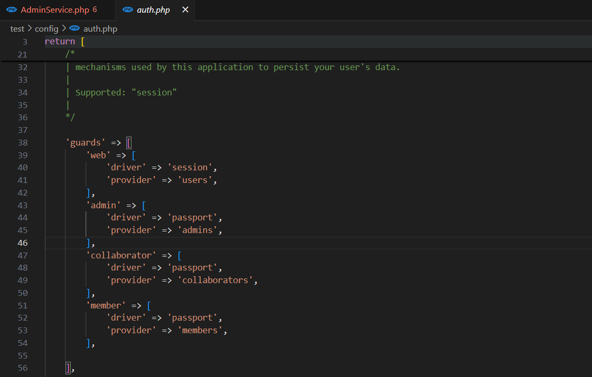
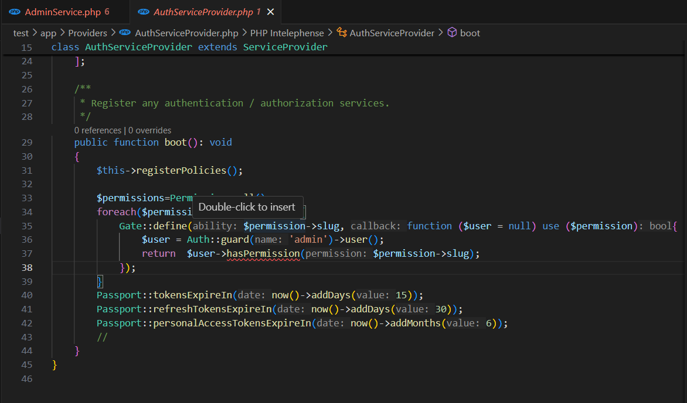
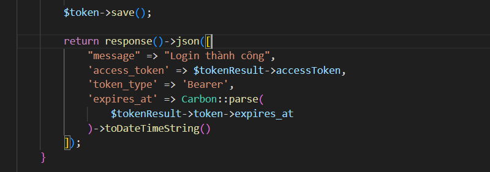

<h1> Phiên bản laravel đang sử dụng  <b>Laravel Framework 11.35.1<b> </h1>
Tạo cơ sở dữ liệu tên login_passport 

<b> Composer create-project laravel/laravel login-passport

<b> php artisan install:api --passport

<b> composer require laravel/passport

<b> php artisan migrate

<b> php artisan passport:install

<h3>App/Models/User.php

  

<h3>Config/auth.php

  

<h3>app/Providers/AuthServiceProvides.php

  

<h3>app/Http/Controller/AuthController.php

  

<h3>Login

  

  

<h3>Register

  

<h3>routes/api.php

  

Để kiểm tra cần có 2 thuộc tính này trong POSTMAN
Content-Type: application/json
Accept: application/json

{
    "username": "testuser01",
    "email": "testuser01@example.com",
    "password": "password123",
    "full_name": "Test User",    
    "address": "123 Main Street",
    "phone": "1234567890"
}
php .\artisan optimize:clear
Mẫu test trên postman